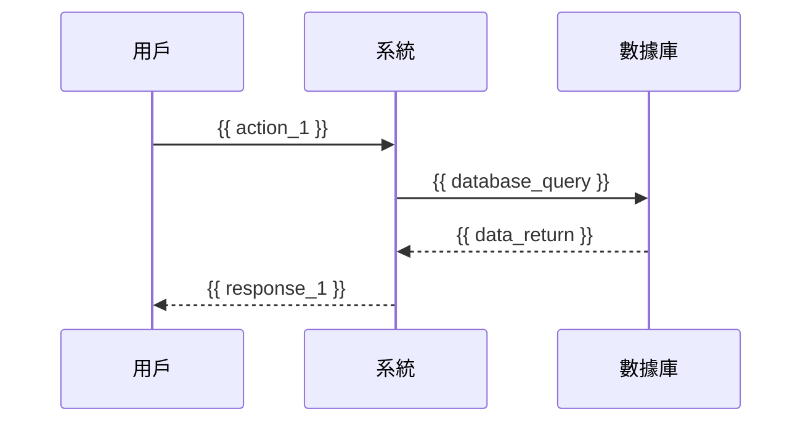

# 功能需求規格書 (Functional Requirements Specification)

> 基於 design_templates 優化的專業功能需求文檔

---

**專案名稱**: {{ project_name }}  
**文件版本**: v0.1  
**最後更新**: {{ current_date }}  
**負責人**: {{ requirements_analyst }}

---

## 📋 文檔概述

### 目的 (Purpose)
本文檔詳細定義系統的功能需求，為後續的系統架構設計和詳細設計提供準確的需求基礎。

### 範圍 (Scope)
- 覆蓋所有核心業務功能
- 定義用戶交互流程
- 明確系統邊界和介面需求

### 目標讀者 (Target Audience)
- 系統架構師
- 開發工程師
- 測試工程師
- 產品經理

---

## 🎯 系統概述

### 系統願景
{{ system_vision }}

### 核心價值主張
{{ value_proposition }}

### 主要用戶群體
1. **{{ primary_user_type }}**: {{ primary_user_description }}
2. **{{ secondary_user_type }}**: {{ secondary_user_description }}

---

## 📖 功能需求詳述

### FR-001: {{ feature_category_1 }}

#### FR-001.1: {{ specific_function_1 }}
- **描述**: {{ function_description }}
- **用戶角色**: {{ user_role }}
- **前置條件**: {{ preconditions }}
- **主要流程**:
  1. {{ step_1 }}
  2. {{ step_2 }}
  3. {{ step_3 }}
- **後置條件**: {{ postconditions }}
- **異常流程**: {{ exception_flows }}
- **驗收標準**:
  - [ ] {{ acceptance_criteria_1 }}
  - [ ] {{ acceptance_criteria_2 }}
  - [ ] {{ acceptance_criteria_3 }}

#### FR-001.2: {{ specific_function_2 }}
- **描述**: {{ function_description }}
- **用戶角色**: {{ user_role }}
- **業務規則**: {{ business_rules }}
- **驗收標準**:
  - [ ] {{ acceptance_criteria }}

### FR-002: {{ feature_category_2 }}

#### FR-002.1: {{ specific_function_3 }}
- **描述**: {{ function_description }}
- **輸入**: {{ input_description }}
- **處理**: {{ processing_description }}
- **輸出**: {{ output_description }}
- **驗收標準**:
  - [ ] {{ acceptance_criteria }}

---

## 🔧 系統功能地圖

```mermaid
graph TD
    A[{{ system_name }}] --> B[{{ module_1 }}]
    A --> C[{{ module_2 }}]
    A --> D[{{ module_3 }}]
    
    B --> B1[{{ function_1_1 }}]
    B --> B2[{{ function_1_2 }}]
    
    C --> C1[{{ function_2_1 }}]
    C --> C2[{{ function_2_2 }}]
    
    D --> D1[{{ function_3_1 }}]
    D --> D2[{{ function_3_2 }}]
```

---

## 🌐 用戶交互流程

### 主要用戶旅程

#### 旅程 1: {{ user_journey_1 }}


#### 旅程 2: {{ user_journey_2 }}
*詳細的步驟描述*

---

## 📊 功能優先級

### P0 - 核心功能 (Must Have)
- [ ] {{ core_function_1 }}
- [ ] {{ core_function_2 }}
- [ ] {{ core_function_3 }}

### P1 - 重要功能 (Should Have)
- [ ] {{ important_function_1 }}
- [ ] {{ important_function_2 }}

### P2 - 增強功能 (Could Have)
- [ ] {{ nice_to_have_1 }}
- [ ] {{ nice_to_have_2 }}

### P3 - 未來功能 (Won't Have)
- [ ] {{ future_function_1 }}
- [ ] {{ future_function_2 }}

---

## 🔗 外部系統整合需求

### 第三方 API 整合
| 系統名稱 | 整合目的 | API 類型 | 優先級 |
|----------|----------|----------|---------|
| {{ external_system_1 }} | {{ integration_purpose }} | REST/GraphQL | P0/P1/P2 |
| {{ external_system_2 }} | {{ integration_purpose }} | REST/GraphQL | P0/P1/P2 |

### 內部系統依賴
- **{{ internal_system_1 }}**: {{ dependency_description }}
- **{{ internal_system_2 }}**: {{ dependency_description }}

---

## 🎯 驗收標準匯總

### 功能驗收標準
- [ ] 所有 P0 功能完整實現
- [ ] 所有主要用戶流程可順利執行
- [ ] 關鍵業務規則正確實施
- [ ] 錯誤處理機制完備

### 質量標準
- [ ] 功能測試覆蓋率 ≥ 90%
- [ ] 用戶體驗符合設計規範
- [ ] 性能指標達到預期要求

---

## 🔄 變更管理

### 需求變更流程
1. **變更申請**: 填寫變更申請表
2. **影響評估**: 評估對進度、成本、質量的影響
3. **決策審批**: 相關利害關係人批准
4. **文檔更新**: 更新需求文檔
5. **團隊同步**: 通知所有相關團隊

### 需求追蹤
| 需求 ID | 變更原因 | 變更內容 | 批准人 | 變更日期 |
|---------|----------|----------|--------|----------|
| FR-001.1 | {{ change_reason }} | {{ change_content }} | {{ approver }} | {{ change_date }} |

---

## 📝 附錄

### 術語表
| 術語 | 定義 |
|------|------|
| {{ term_1 }} | {{ definition_1 }} |
| {{ term_2 }} | {{ definition_2 }} |

### 參考文檔
- [專案簡報](../clarifications/project_brief_template.md)
- [系統架構設計](../../1_design/architecture/system_architecture.md)
- [API 設計規範](../../1_design/api-contracts/api_specification.md)

---

**文檔審核記錄**:

| 日期 | 審核人 | 版本 | 變更摘要 |
|------|--------|------|----------|
| {{ date }} | {{ reviewer }} | v0.1 | 初始版本 |

---
*本文檔將自動同步到下一階段的設計文檔中* 