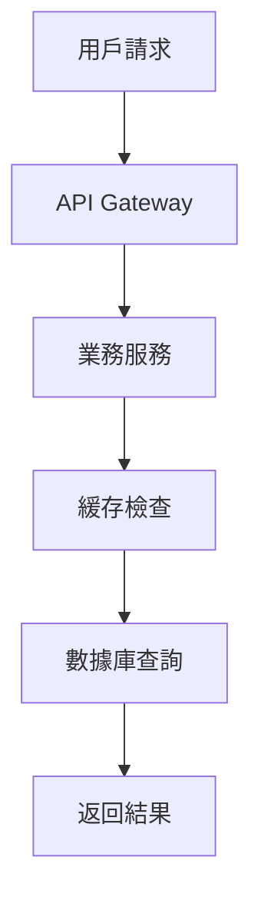
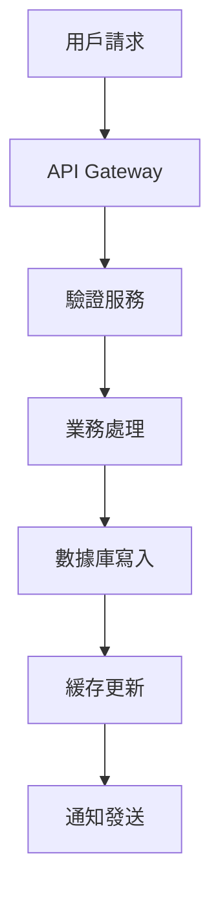

# 系統架構設計文檔

**項目名稱**: {{ project_name }}  
**架構師**: {{ architect_name }}  
**版本**: {{ version }}  
**日期**: {{ date }}

## 🎯 架構目標

### 業務目標
- {{ business_goal_1 }}
- {{ business_goal_2 }}
- {{ business_goal_3 }}

### 技術目標
- **性能**: {{ performance_target }}
- **可用性**: {{ availability_target }}
- **擴展性**: {{ scalability_target }}
- **安全性**: {{ security_target }}

## 🏗️ 整體架構

### 架構風格
**選擇**: {{ architecture_style }}  
**理由**: {{ architecture_rationale }}

### 核心原則
1. **單一職責**: 每個服務只負責一個業務領域
2. **松耦合**: 服務間通過標準接口通信
3. **高內聚**: 相關功能集中在同一服務中
4. **容錯設計**: 服務故障不影響整體系統

## 📊 系統組件

### 前端層 (Presentation Layer)
```
{{ frontend_architecture }}
```
- **框架**: {{ frontend_framework }}
- **狀態管理**: {{ state_management }}
- **路由**: {{ routing_solution }}

### API 層 (API Layer)
```
{{ api_architecture }}
```
- **API Gateway**: {{ api_gateway }}
- **認證**: {{ authentication }}
- **限流**: {{ rate_limiting }}

### 業務邏輯層 (Business Logic Layer)
```
{{ business_layer_architecture }}
```
- **核心服務**: {{ core_services }}
- **業務規則**: {{ business_rules }}
- **工作流**: {{ workflow_engine }}

### 數據層 (Data Layer)
```
{{ data_architecture }}
```
- **主數據庫**: {{ primary_database }}
- **緩存**: {{ caching_solution }}
- **搜索**: {{ search_engine }}

## 🔄 數據流程

### 讀取流程


### 寫入流程


## 🛡️ 安全架構

### 認證授權
- **認證方式**: {{ authentication_method }}
- **授權模型**: {{ authorization_model }}
- **Token 管理**: {{ token_management }}

### 數據安全
- **加密方式**: {{ encryption_method }}
- **敏感數據**: {{ sensitive_data_handling }}
- **審計日誌**: {{ audit_logging }}

## 📈 可擴展性設計

### 水平擴展
- **負載均衡**: {{ load_balancing }}
- **服務分片**: {{ service_sharding }}
- **數據分片**: {{ data_sharding }}

### 垂直擴展
- **資源配置**: {{ resource_allocation }}
- **性能監控**: {{ performance_monitoring }}
- **自動伸縮**: {{ auto_scaling }}

## 🔧 技術棧

### 後端技術
- **語言**: {{ backend_language }}
- **框架**: {{ backend_framework }}
- **數據庫**: {{ database }}
- **緩存**: {{ cache }}
- **消息隊列**: {{ message_queue }}

### 前端技術
- **語言**: {{ frontend_language }}
- **框架**: {{ frontend_framework }}
- **構建工具**: {{ build_tools }}
- **測試框架**: {{ testing_framework }}

### 基礎設施
- **雲平台**: {{ cloud_platform }}
- **容器化**: {{ containerization }}
- **編排**: {{ orchestration }}
- **監控**: {{ monitoring }}

## 🚀 部署架構

### 環境規劃
```
{{ deployment_environments }}
```

### CI/CD 流程
```
{{ cicd_pipeline }}
```

## 📊 性能指標

| 指標 | 目標值 | 測量方式 |
|------|--------|----------|
| 響應時間 | {{ response_time }} | {{ measurement_method }} |
| 吞吐量 | {{ throughput }} | {{ measurement_method }} |
| 可用性 | {{ availability }} | {{ measurement_method }} |
| 錯誤率 | {{ error_rate }} | {{ measurement_method }} |

## 🔍 監控和運維

### 監控策略
- **應用監控**: {{ application_monitoring }}
- **基礎設施監控**: {{ infrastructure_monitoring }}
- **業務監控**: {{ business_monitoring }}

### 日誌管理
- **日誌收集**: {{ log_collection }}
- **日誌分析**: {{ log_analysis }}
- **告警機制**: {{ alerting }}

---
*使用 VibeCoding 自動生成和維護架構文檔* 