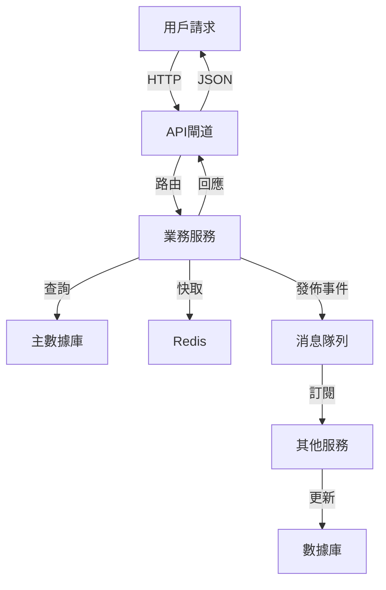

# 系統架構設計文檔 (System Architecture Document) - {{ project_name }}

> 基於 VibeCoding design_templates/02_system_architecture_document_template.md 優化

---

**文件版本 (Document Version):** `v0.1`

**最後更新 (Last Updated):** `{{ current_date }}`

**主要作者/架構師 (Lead Author/Architect):** `{{ architect_name }}`

**審核者 (Reviewers):** `{{ reviewers_list }}`

**狀態 (Status):** `草稿 (Draft) | 審核中 (In Review) | 已批准 (Approved) | 進行中 (Active)`

**相關 PRD/專案簡報:** `[連結到 ../0_discovery/clarifications/project_brief_template.md]`

**相關 ADRs:** `[列出此架構設計所依賴或產生的重要 ADR 編號]`

---

## 目錄 (Table of Contents)

1. [引言 (Introduction)](#1-引言-introduction)
2. [架構概述與目標 (Architecture Overview and Goals)](#2-架構概述與目標)
3. [需求回顧 (Requirements Revisited)](#3-需求回顧)
4. [高層次架構設計 (High-Level Architectural Design)](#4-高層次架構設計)
5. [技術選型詳述 (Technology Stack Details)](#5-技術選型詳述)
6. [可行性分析概要 (Feasibility Analysis Summary)](#6-可行性分析概要)
7. [Production Readiness Checklist (PRC) - 初步考量](#7-prc-初步考量)
8. [未來展望與演進方向](#8-未來展望與演進方向)

---

## 1. 引言 (Introduction)

### 1.1 目的與範圍 (Purpose and Scope)
**目的**: 為 {{ project_name }} 提供一個清晰、一致的高層次架構藍圖，指導後續的詳細設計和開發實施。

**範圍**: 本架構文檔涵蓋系統的整體架構設計、技術選型決策、以及關鍵的非功能性需求實現策略。

### 1.2 目標讀者 (Target Audience)
- 專案開發團隊
- 系統架構師
- 技術主管
- DevOps/SRE 團隊
- 產品經理

### 1.3 參考文件 (References)
- [專案簡報 PRD](../0_discovery/clarifications/project_brief_template.md)
- [功能需求規格書](../0_discovery/requirements/functional_requirements_template.md)
- [相關 ADR 文檔](./adrs/)

---

## 2. 架構概述與目標 (Architecture Overview and Goals)

### 2.1 系統願景與核心價值 (System Vision and Core Values)
{{ system_vision_statement }}

### 2.2 架構目標與原則 (Architectural Goals and Principles)

#### 架構目標 (Goals)
- **高可用性**: 系統可用性達到 99.9% SLA
- **可擴展性**: 支持水平擴展至 {{ target_scale }}
- **高性能**: API 響應時間 P95 < {{ performance_target }}ms
- **安全性**: 符合 {{ security_standards }} 安全標準
- **可維護性**: 新功能開發週期 < {{ development_cycle_target }} 天

#### 設計原則 (Principles)
1. **API 優先設計**: 所有服務通過標準化 API 通信
2. **微服務架構**: 業務域清晰分離，獨立部署
3. **事件驅動**: 使用事件驅動架構實現鬆耦合
4. **無狀態服務**: 服務本身不保存狀態，支持水平擴展
5. **容錯設計**: 假設任何組件都可能失敗
6. **可觀測性優先**: 內建監控、日誌、追蹤機制

### 2.3 主要制約因素與假設 (Key Constraints and Assumptions)

#### 制約因素 (Constraints)
- **預算限制**: {{ budget_constraints }}
- **時程限制**: {{ timeline_constraints }}
- **技能限制**: {{ team_skill_constraints }}
- **合規要求**: {{ compliance_requirements }}

#### 假設 (Assumptions)
- {{ key_assumption_1 }}
- {{ key_assumption_2 }}
- {{ key_assumption_3 }}

---

## 3. 需求回顧 (Requirements Revisited)

### 3.1 功能性需求摘要 (Functional Requirements Summary)
*從架構視角重新審視核心功能需求*

- **核心功能 1**: {{ core_function_1_description }}
- **核心功能 2**: {{ core_function_2_description }}
- **核心功能 3**: {{ core_function_3_description }}

### 3.2 非功能性需求 (Non-Functional Requirements - NFRs)

| NFR 分類 | 具體需求描述 | 衡量指標/目標值 |
|----------|-------------|----------------|
| **性能 (Performance)** | API 端點平均響應時間 | < {{ api_response_time }}ms (P95) |
| | 系統吞吐量 | {{ throughput_target }} TPS |
| **可擴展性 (Scalability)** | 支持用戶增長 | 線性擴展至 {{ max_users }} 用戶 |
| **可用性 (Availability)** | 核心服務年可用性 | {{ availability_target }}% (SLA) |
| **可靠性 (Reliability)** | 數據丟失容忍度 | RPO < {{ rpo_target }} hour |
| **安全性 (Security)** | 數據傳輸加密 | TLS 1.3+ |
| | 身份驗證機制 | OAuth 2.0 / JWT |
| **可維護性 (Maintainability)** | 新開發者上手時間 | < {{ onboarding_time }} 天 |
| | 代碼複雜度 | 平均圈複雜度 < 10 |

---

## 4. 高層次架構設計 (High-Level Architectural Design)

### 4.1 選定的架構模式 (Chosen Architectural Pattern)
**選擇**: {{ chosen_architecture_pattern }}

**選擇理由**: {{ architecture_choice_rationale }}

### 4.2 系統組件圖 (System Component Diagram)

```mermaid
graph TD
    subgraph "用戶層"
        A[Web App] 
        B[Mobile App]
        C[Admin Dashboard]
    end
    
    subgraph "API 閘道層"
        D[API Gateway]
        E[Load Balancer]
    end
    
    subgraph "應用服務層"
        F[{{ service_1 }}]
        G[{{ service_2 }}]
        H[{{ service_3 }}]
        I[{{ service_4 }}]
    end
    
    subgraph "數據層"
        J[{{ primary_database }}]
        K[{{ cache_solution }}]
        L[{{ message_queue }}]
    end
    
    subgraph "基礎設施層"
        M[監控系統]
        N[日誌系統]
        O[配置管理]
    end
    
    A --> D
    B --> D  
    C --> D
    D --> E
    E --> F
    E --> G
    E --> H
    E --> I
    
    F --> J
    F --> K
    G --> J
    G --> L
    H --> K
    I --> J
    
    F --> M
    G --> M
    H --> M
    I --> M
    
    F --> N
    G --> N
    H --> N
    I --> N
```

### 4.3 主要組件/服務及其職責 (Key Components/Services and Responsibilities)

| 組件/服務名稱 | 核心職責 | 主要技術/框架 | 預期 Owner | 依賴的其他組件 | 初步SLA/SLO |
|--------------|----------|---------------|------------|---------------|-------------|
| {{ service_1 }} | {{ service_1_responsibility }} | {{ service_1_tech }} | {{ service_1_owner }} | {{ service_1_dependencies }} | {{ service_1_sla }} |
| {{ service_2 }} | {{ service_2_responsibility }} | {{ service_2_tech }} | {{ service_2_owner }} | {{ service_2_dependencies }} | {{ service_2_sla }} |
| {{ service_3 }} | {{ service_3_responsibility }} | {{ service_3_tech }} | {{ service_3_owner }} | {{ service_3_dependencies }} | {{ service_3_sla }} |

### 4.4 資料流圖 (Data Flow Diagrams)

#### 主要業務流程資料流


---

## 5. 技術選型詳述 (Technology Stack Details)

### 5.1 前端技術棧 (Frontend Stack)
- **主要框架**: {{ frontend_framework }}
  - **選擇理由**: {{ frontend_choice_reason }} (引用 ADR-{{ adr_number }})
- **狀態管理**: {{ state_management }}
- **UI 組件庫**: {{ ui_library }}
- **構建工具**: {{ build_tools }}

### 5.2 後端技術棧 (Backend Stack)
- **主要語言/運行時**: {{ backend_language }}
  - **選擇理由**: {{ backend_choice_reason }} (引用 ADR-{{ adr_number }})
- **主要框架**: {{ backend_framework }}
- **API 規格語言**: {{ api_spec_language }}

### 5.3 資料庫與儲存 (Databases and Storage)
- **主要關聯式資料庫**: {{ primary_database }}
  - **選擇理由**: {{ db_choice_reason }} (引用 ADR-{{ adr_number }})
- **快取方案**: {{ cache_solution }}
- **對象儲存**: {{ object_storage }}

### 5.4 訊息佇列/事件流 (Message Queues/Event Streaming)
- **選用技術**: {{ message_queue_tech }}
- **使用場景**: {{ mq_use_cases }}
- **選擇理由**: {{ mq_choice_reason }} (引用 ADR-{{ adr_number }})

### 5.5 基礎設施與部署 (Infrastructure and Deployment)
- **雲服務商**: {{ cloud_provider }}
- **容器化技術**: {{ containerization }}
- **容器編排**: {{ orchestration }}
- **CI/CD 工具**: {{ cicd_tools }}
- **IaC 工具**: {{ iac_tools }}

### 5.6 可觀測性工具 (Observability Stack)
- **日誌管理**: {{ logging_solution }}
- **指標監控**: {{ metrics_solution }}
- **分散式追蹤**: {{ tracing_solution }}
- **告警系統**: {{ alerting_solution }}

---

## 6. 可行性分析概要 (Feasibility Analysis Summary)

### 6.1 技術可行性評估 (Technical Feasibility)
{{ technical_feasibility_assessment }}

### 6.2 經濟可行性/成本效益分析 (Economic Feasibility)
{{ economic_feasibility_assessment }}

### 6.3 時程可行性與資源預估 (Schedule Feasibility)
{{ schedule_feasibility_assessment }}

### 6.4 關鍵風險識別與緩解策略 (Key Risks)

| 風險描述 | 核心緩解策略 |
|----------|-------------|
| {{ risk_1 }} | {{ mitigation_1 }} |
| {{ risk_2 }} | {{ mitigation_2 }} |
| {{ risk_3 }} | {{ mitigation_3 }} |

---

## 7. Production Readiness Checklist (PRC) - 初步考量

### 可觀測性 (Observability)
- [ ] 定義核心業務指標和系統指標
- [ ] 設計統一的日誌格式標準
- [ ] 規劃分散式追蹤策略

### 可擴展性 (Scalability)
- [ ] 識別潛在性能瓶頸
- [ ] 設計水平擴展策略
- [ ] 規劃負載測試計劃

### 安全性與機密管理 (Security & Secrets)
- [ ] 定義主要威脅模型
- [ ] 設計數據加密策略
- [ ] 規劃 API 認證授權機制
- [ ] 設計機密管理流程

### 可靠性與容錯 (Reliability & Fault Tolerance)
- [ ] 識別單點故障風險
- [ ] 設計重試和斷路器機制
- [ ] 規劃災難恢復策略

---

## 8. 未來展望與演進方向 (Future Considerations and Evolution)

{{ future_evolution_plans }}

---

**文件審核記錄 (Review History):**

| 日期 | 審核人 | 版本 | 變更摘要/主要反饋 |
|------|--------|------|------------------|
| {{ date }} | {{ reviewer }} | v0.1 | 初稿提交 |

---

**下一步行動**:
- [ ] 完成系統架構審查
- [ ] 創建 [ADR 文檔](./adrs/)
- [ ] 進入 [詳細設計階段](../2_implementation/)
- [ ] 使用 `vibecoding generate architecture` 生成架構代碼

---
*本文檔基於 VibeCoding design_templates 優化，確保與 PRR 流程無縫銜接* 