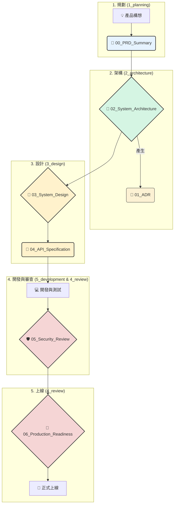

# 軟體開發流程完整使用手冊 (SOP)

---

## 1. 核心理念與目的

本手冊旨在提供一套標準化、端到端的軟體開發流程，引導團隊從產品構想（0）到成功上線（1）。我們的核心理念是：

*   **前置思考，降低風險**: 在投入大量開發前，透過結構化的設計與審查，提前暴露問題、對齊認知。
*   **職責分離，流程清晰**: 每個階段都有明確的目標、產出和負責人，確保高效協作。
*   **文檔即契約**: 所有設計文檔是跨團隊溝通的「單一事實來源」，是我們的共同契約。
*   **持續學習，持續改進**: 開發過程中的經驗教訓會被記錄、分享，並反饋到未來的流程中。

## 2. 開發流程全景圖

整個開發流程分為五大階段，每個階段都會產出關鍵的設計文檔，存放在對應的資料夾中。

---

## 3. 各階段詳細指南 (TO-DO & Checklist)

### **階段一：構想與規劃 (What & Why)**

*   **目標**: 將模糊的商業想法轉化為清晰、可執行的專案定義。
*   **產出文檔**: `1_planning/00_project_brief_prd_summary_vX.X.md`
*   **使用模板**: `design_templates/00_project_brief_prd_summary_template.md`
*   **主要負責人**: 產品經理 (PM), 專案負責人 (Project Lead)

#### TO-DO List:
1.  **複製模板**: 從 `design_templates` 複製模板到 `1_planning` 資料夾，並重命名。
2.  **召開會議**: PM 召集核心成員（Tech Lead, Design Lead），共同填寫 PRD 摘要。
3.  **定義問題 (Problem Statement)**: 精確描述要解決的用戶痛點或市場機會。
4.  **定義目標與指標 (Goals & Success Metrics)**: 設定 1-3 個可量化的核心目標 (KPIs)。如果無法衡量，就無法管理。
5.  **劃定範圍 (Non-Goals)**: 明確定義「不做什麼」，以防止後續的範圍蔓延。這是確保專案聚焦的關鍵。
6.  **定義使用者故事 (User Stories)**: 列出最高優先級的核心使用者故事。
7.  **審核與共識**: 召開 Kick-off 會議，邀請所有利害關係人審核此文檔，確保全員對目標和範圍達成共識。

#### Checklist (完成此階段的標準):
- [ ] PRD 摘要已填寫完畢。
- [ ] 核心目標、KPI、範圍已明確定義。
- [ ] 所有利害關係人已在 Kick-off 會議上對內容達成共識。
- [ ] 最終文檔已存放在 `1_planning` 資料夾。

---

### **階段二：高層次設計 (System Architecture)**

*   **目標**: 根據 PRD，設計出系統的技術藍圖，決定系統的骨架和技術方向。
*   **產出文檔**: 
    *   `2_architecture/02_system_architecture_document_vX.X.md`
    *   `2_architecture/adrs/ADR-XXX_[決策標題].md`
*   **使用模板**: 
    *   `design_templates/02_system_architecture_document_template.md`
    *   `design_templates/01_adr_template.md`
*   **主要負責人**: 架構師 (Architect), 技術負責人 (Tech Lead)

#### TO-DO List:
1.  **撰寫 SA 文檔**:
    *   從 `design_templates` 複製 SA 模板至 `2_architecture`。
    *   將 PRD 的需求轉化為「非功能性需求 (NFRs)」，如性能、可用性、擴展性等。
    *   繪製「系統組件圖」，清晰地展示系統由哪些服務/模組構成，以及它們之間的關係。
    *   在「技術選型」部分，初步確定主要技術棧（語言、框架、資料庫等）。
2.  **記錄 ADR (架構決策紀錄)**:
    *   在設計過程中，每當遇到一個需要權衡的重要決策時（例如：選擇 Kafka vs. RabbitMQ），就複製一份 ADR 模板到 `adrs` 資料夾。
    *   在 ADR 中，清晰地記錄**背景**、**所有考慮過的選項**（及其優缺點）、**最終決策**以及**選擇該決策的理由**。
    *   在 SA 文檔中引用這些 ADR (例如：`選擇理由: [...] (詳見 ADR-001)`)。
3.  **SA 審查**: 召集開發團隊和相關架構師，對 SA 文檔進行審查，確保設計的合理性和可行性。

#### Checklist:
- [ ] SA 文檔已完成，並清晰地定義了系統邊界、組件和關係。
- [ ] 關鍵的非功能性需求已被量化。
- [ ] 主要技術選型已確定，並有對應的 ADR 作為支撐。
- [ ] SA 文檔已通過團隊審查。

---

### **階段三：詳細設計 (System Design)**

*   **目標**: 將 SA 中的宏觀藍圖細化為開發人員可以動手實現的具體規格。
*   **產出文檔**: 
    *   `3_design/[module_name]/03_system_design_document_vX.X.md`
    *   `3_design/[module_name]/04_api_design_specification_vX.X.md`
*   **使用模板**:
    *   `design_templates/03_system_design_document_template.md`
    *   `design_templates/04_api_design_specification_template.md`
*   **主要負責人**: 開發團隊, 技術負責人

#### TO-DO List:
1.  **為每個模組撰寫 SDD**: 針對 SA 中的每一個主要模組/服務，在 `3_design` 下創建對應的子資料夾，並撰寫 SDD。
2.  **設計數據模型 (Database Design)**: 設計詳細的表結構、欄位、類型、索引，並繪製 ER 圖。這是最關鍵的步驟之一。
3.  **設計 API 規格 (API Design)**:
    *   如果模組對外提供 API，使用 API 模板定義其規格。
    *   詳細定義每一個端點的請求/回應格式、錯誤碼、認證方式等。
4.  **設計核心流程**: 對於複雜的業務邏輯，使用序列圖、活動圖或流程圖進行可視化描述。
5.  **詳細設計審查 (Design Review)**: 團隊內部進行程式碼級別的設計審查，確保所有開發者對實現方案有一致的理解。

#### Checklist:
- [ ] 每個核心模組都有對應的 SDD 文件。
- [ ] 數據庫 Schema 和資料字典已定義。
- [ ] 對外 API 有詳細、清晰的規格說明。
- [ ] 複雜邏輯有對應的流程圖或序列圖。
- [ ] 所有 SDD 和 API 規格都已通過團隊內部審查。

---

### **階段四：開發與安全審查**

*   **目標**: 根據設計文檔完成高品質的程式碼開發，並通過安全審查。
*   **指導文件**:
    *   **`development_guideline.md`**: **(必讀)** 本階段所有開發活動均需遵循此文件定義的編碼風格、版本控制、Code Review流程等工程實踐。
    *   `4_review/05_security_privacy_review_checklist_vX.X.md`
*   **主要負責人**: 開發團隊, 安全團隊

#### TO-DO List:
1.  **遵循開發指引**: 在開始編寫任何程式碼之前，團隊成員必須閱讀並理解 `development_guideline.md` 中的所有規範。
2.  **程式碼開發**: 依照 SDD 和 API 規格進行開發，撰寫單元測試與整合測試。
3.  **提交安全審查**: 開發團隊完成設計和初步開發後，提交給安全團隊進行審查。
4.  **完成安全檢查清單**: 安全團隊使用 `05_security_privacy_review_checklist_template.md` 逐項評估，檢查數據加密、權限控制、輸入驗證等是否存在漏洞。
5.  **修復問題**: 開發團隊根據審查報告修復已發現的安全問題。

#### Checklist:
- [ ] 核心功能已開發完成。
- [ ] 單元測試和整合測試達到團隊標準。
- [ ] 安全審查已完成，所有高風險問題已修復。
- [ ] 審查報告已存檔於 `4_review` 資料夾。

---

### **階段五：生產就緒審查與上線**

*   **目標**: 在服務正式上線前的最後一關，確保服務是穩定、可靠、可維護且可觀測的。
*   **產出文檔**: `4_review/06_production_readiness_review_template.md`
*   **主要負責人**: SRE 團隊, 維運團隊 (Ops), 技術負責人

#### TO-DO List:
1.  **自我評估**: 開發團隊在上線前，填寫 PRR 清單（`06_production_readiness_review_template.md`）進行自我檢查。
2.  **準備證明材料**: 準備好監控儀表板、告警配置、運維手冊 (Runbook)、部署和回滾計畫的連結。
3.  **召開 PRR 會議**: 開發團隊向審查委員會（SRE, Ops, Architect）展示服務已準備好上線。審查重點包括**可觀測性、告警、可靠性、運維支持**。
4.  **獲得上線許可**: 審查委員會給出「Go / No-Go / Go with Conditions」的最終決策。

#### Checklist:
- [ ] 監控、日誌、告警已配置並驗證有效。
- [ ] 已有清晰的運維手冊 (Runbook)。
- [ ] 部署和回滾計畫已經過演練。
- [ ] 已獲得 PRR 委員會的「Go」決策。
- [ ] PRR 報告已存檔於 `4_review` 資料夾。

---

## 4. 持續性實踐：記錄經驗教訓 (Scratchpad)

*   **目標**: 將開發過程中的思考、遇到的問題、解決方案和靈感即時記錄下來，形成團隊的動態知識庫。
*   **使用文件**: `經驗教訓/Scratchpad.md`

#### 如何使用:
*   **隨時記錄**: 當你解決了一個棘手的 bug、學到一個新工具的巧妙用法、或對現有架構有了新的想法時，立即在 `Scratchpad.md` 中記錄下來。
*   **格式自由**: 不需要嚴格的格式，可以是代碼片段、幾句話的總結、或是外部文章的連結。
*   **定期回顧**: 在團隊會議或專案復盤時，回顧 `Scratchpad.md` 的內容，將有價值的條目轉化為：
    *   新的 **ADR**。
    *   團隊的**開發規範**。
    *   未來專案的**待辦事項**。

這種實踐能確保我們的經驗不會流失，讓團隊持續進化。

---

## 5. 文件生命週期與迭代策略

為了確保流程順暢，理解每個文件的創建時機和其後續的迭代方式至關重要。下表總結了各類文件的生命週期：

| 文件類型                                       | 創建時機 (階段) | 迭代策略 (How it evolves)                                                                                                    | 說明                                                                                               |
| :--------------------------------------------- | :-------------- | :--------------------------------------------------------------------------------------------------------------------------- | :------------------------------------------------------------------------------------------------- |
| **`00_project_brief_prd_summary`**             | 1. 規劃         | **基準 (Baseline)**                                                                                                          | 專案的起始點。創建後應保持穩定，作為後續所有設計的依據。只有在發生重大需求變更時才應更新，並通知所有利害關係人。         |
| **`development_guideline.md`**                 | 0. 專案啟動前    | **分段演進 (Phased Evolution)**                                                                                              | 「通用實踐」部分應保持穩定。「專案特定指南」部分在**階段 2 (架構)** 後填充，然後保持穩定，作為開發階段的最高準則。       |
| **`02_system_architecture_document`**          | 2. 架構         | **動態演進 ➔ 基準 (Living ➔ Baseline)**                                                                                      | 在架構設計階段是動態文件。一旦審查通過，即成為後續詳細設計的穩定基準。若需重大變更，必須透過新的 ADR 進行記錄。           |
| **`ADR-XXX`**                                  | 2. 架構         | **不可變快照 (Immutable Snapshot)**                                                                                          | 記錄某個時間點的決策。一旦狀態變為 `Accepted`，就不應再修改。若決策過時，應創建一個新的 ADR 來 `Supersede` (取代) 它。 |
| **`03_system_design_document`**                | 3. 設計         | **動態演進 (Living Document)**                                                                                               | 在其對應的模組開發期間，這是最主要的動態設計文檔，會隨著開發的深入不斷細化和更新。                                       |
| **`04_api_design_specification`**              | 3. 設計         | **動態演進 (Living Document)**                                                                                               | API 在穩定發布前會持續迭代。一旦發布 v1.0.0，此文件應趨於穩定。後續變更應遵循版本控制策略 (例如發布 v1.1.0)。           |
| **`05_security_review_checklist`**             | 4. 開發與審查     | **時間點快照 (Point-in-Time Snapshot)**                                                                                      | 記錄特定版本的程式碼在某個時間點的安全審查結果。它是一個已完成的檢查記錄，用於存檔。新的審查會產生新的文件。             |
| **`06_production_readiness_review`**           | 5. 上線         | **時間點快照 (Point-in-Time Snapshot)**                                                                                      | 記錄服務上線前的最終審查結果。同安全審查一樣，是存檔性質的快照文件。                                                   |
| **`Scratchpad.md`**                            | 全流程           | **持續累積 (Continuous Accumulation)**                                                                                       | 專案的動態知識庫和筆記本。在專案的任何階段都可以隨時添加內容，格式不拘，用於捕捉靈感、記錄問題和總結經驗。               |

這種實踐能確保我們的經驗不會流失，讓團隊持續進化。 