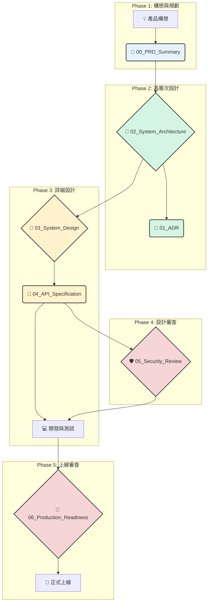
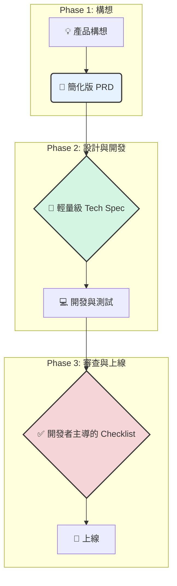

好的，這是一份為您的團隊量身打造的「產品開發流程說明書」。它將指導開發人員如何使用您提供的這套設計模板，從一個初始構想（0）逐步推進到一個成熟、可上線的產品（1）。

---

# 產品開發流程使用說明書 (0 to 1 Guide)

## 1. 核心理念

本流程旨在將一個模糊的產品構想，轉化為一個結構清晰、品質可靠、易於維護的線上服務。其核心理念是：

*   **前置思考，降低風險**: 在投入大量開發成本前，通過文檔化的設計與審查，提前暴露問題、對齊認知、消除模糊地帶。
*   **職責分離，流程清晰**: 每個階段都有明確的目標、產出和負責人，讓團隊成員各司其職。
*   **文檔即契約**: 設計文檔是產品、開發、測試、維運團隊之間共同的「契約」和「事實的單一來源 (Single Source of Truth)」。

## 2. 開發流程概覽

整個開發流程分為五大階段，涉及七個核心文檔模板。ADR（架構決策記錄）會在設計階段持續產生。



---

## 3. 各階段詳細指南

### **階段一：構想與規劃 (What & Why)**

*   **目標**: 將模糊的商業想法轉化為清晰、可執行的專案定義。
*   **核心文檔**: `00_project_brief_prd_summary_template.md`
*   **負責人**: 產品經理 (PM)、專案負責人 (Project Lead)
*   **執行步驟**:
    1.  **填寫 PRD**: PM 召集核心成員，共同填寫此模板。
    2.  **明確問題**: 最關鍵的是定義好「1.2 問題陳述」，即我們要解決什麼問題。
    3.  **定義成功**: 在「1.5 專案目標與成功指標」中，定義可量化的 KPI。如果無法衡量，就無法知道專案是否成功。
    4.  **劃定範圍**: 在「(選填) 非目標」中，明確寫下**不做什麼**，這和做什麼同等重要，是防止範圍蔓延的關鍵。
    5.  **召開 kickoff 會議**: 邀請所有利害關係人（產品、開發、測試、設計等），共同審核 PRD 內容，確保所有人對目標和範圍達成共識。
*   **產出**: 一份經過所有利害關係人確認的 **PRD 摘要**，這是後續所有技術設計的唯一依據。

---

### **階段二：高層次設計 (System Architecture)**

*   **目標**: 根據 PRD，設計出系統的技術藍圖，決定系統的骨架和技術方向。
*   **核心文檔**:
    *   `02_system_architecture_document_template.md` (SA)
    *   `01_adr_template.md` (ADR)
*   **負責人**: 架構師 (Architect)、技術負責人 (Tech Lead)
*   **執行步驟**:
    1.  **撰寫 SA**:
        *   將 PRD 的「功能需求」和「非功能需求」（性能、可用性、擴展性等）作為設計的輸入。
        *   使用「4.2 系統組件圖」畫出系統由哪些主要服務/模組構成，以及它們之間的關係。
        *   在「5. 技術選型詳述」中，確定主要的程式語言、框架、資料庫、雲服務等。
    2.  **記錄 ADR**:
        *   在設計過程中，每當遇到一個需要權衡的重要決策時（例如：「為什麼我們選擇 PostgreSQL 而不是 MySQL？」、「為什麼我們採用事件驅動架構？」），就創建一個新的 ADR 文件。
        *   在 ADR 中，清晰地記錄**背景**、**所有考慮過的選項**（及其優缺點）、**最終決策**以及**選擇該決策的理由**。
        *   在 SA 文檔中引用這些 ADR（例如：`選擇理由: [...] (詳見 ADR-001)`）。
*   **產出**:
    *   一份已批准的 **SA 文檔**，定義了系統的整體結構和技術棧。
    *   數份 **ADR 文檔**，作為重要技術決策的歷史檔案。

---

### **階段三：詳細設計 (System Design)**

*   **目標**: 將 SA 中的宏觀藍圖細化為開發人員可以動手實現的具體規格。
*   **核心文檔**:
    *   `03_system_design_document_template.md` (SDD)
    *   `04_api_design_specification_template.md` (API Spec)
*   **負責人**: 開發團隊、技術負責人
*   **執行步驟**:
    1.  **為每個模組撰寫 SDD**: 針對 SA 中的每一個主要模組或服務，創建一份對應的 SDD。
    2.  **設計數據模型**: 在「3.3 資料庫設計」中，設計詳細的表結構、欄位、類型、索引，並畫出 ER 圖。這是最關鍵的步驟之一。
    3.  **設計程式結構**: 在「3.1 模組結構與組件設計」中，使用類別圖等描述模組內部的程式結構。
    4.  **設計 API**:
        *   如果模組需要對外提供 API，使用 `04_api_design_specification_template.md` 來定義。
        *   在「6. API 端點詳述」中，詳細定義每一個端點的請求方法、路徑、參數、請求體和回應體。
        *   在「4. 錯誤處理」中，定義統一的錯誤回報格式。這對 API 消費者極為重要。
    5.  **設計核心流程**: 對於複雜的業務邏輯，使用序列圖、活動圖或流程圖在「3.4 核心演算法/邏輯流程」中進行可視化描述。
*   **產出**: 一套（或多套）詳盡的 **SDD** 和 **API 規範**，開發人員可以依此直接進行編碼工作。

---

### **階段四：設計審查 (Review)**

*   **目標**: 在編碼前，由安全和隱私專家對設計進行審查，提前發現並修復潛在風險。
*   **核心文檔**: `05_security_privacy_review_checklist_template.md`
*   **負責人**: 安全團隊、隱私顧問、專案負責人
*   **執行步驟**:
    1.  **提交審查**: 開發團隊完成 SA 和 SDD 後，提交給安全團隊進行審查。
    2.  **逐項檢查**: 安全團隊使用此 Checklist，系統性地評估設計文檔，檢查數據加密、權限控制、輸入驗證等方面是否存在漏洞。
    3.  **記錄與修復**: 審查結果（發現的問題和修復建議）會被記錄下來。開發團隊必須根據建議修改設計，直到通過審查。
*   **產出**: 一份已完成的**安全與隱私審查報告**，以及更新後的、更安全的設計文檔。

---

### **階段五：生產就緒審查 (Production Readiness)**

*   **目標**: 在服務正式上線前的最後一關，確保服務是穩定、可靠、可維護且可觀測的。
*   **核心文檔**: `06_production_readiness_review_template.md` (PRR)
*   **負責人**: SRE 團隊、維運團隊 (Ops)、技術負責人
*   **執行步驟**:
    1.  **自我評估**: 開發團隊在開發和測試完成後，上線前，首先填寫這份 PRR 清單進行自我檢查。
    2.  **準備證明材料**: 團隊必須提供關鍵材料的連結，如：監控儀表板 (Dashboard)、告警配置 (Alerting)、運維手冊 (Runbook)、部署和回滾計畫。
    3.  **召開 PRR 會議**: 開發團隊向審查委員會（由 SRE、Ops、架構師等組成）展示服務已準備好上線。
    4.  **嚴格審查**: 審查委員會將重點關注：
        *   **可觀測性**: 服務出問題時，我們能看到嗎？（日誌、指標、追蹤）
        *   **告警**: 服務出問題時，我們會被通知嗎？
        *   **可靠性**: 服務能自我恢復嗎？備份和回滾計畫可靠嗎？
        *   **運維支持**: On-call 人員知道如何處理緊急情況嗎？(Runbook)
    5.  **做出決策**: 審查委員會給出「Go / No-Go / Go with Conditions」的最終決策。
*   **產出**: 一份已簽署的 **PRR 文檔**，代表專案已獲得上線許可。

---

## 4. 總結

遵循此流程可以幫助您的團隊：
*   **減少混亂**: 每個人都知道在每個階段該做什麼，該產出什麼。
*   **提升質量**: 通過多層次的設計和審查，在早期就發現問題。
*   **積累知識**: 所有設計和決策都有據可查，方便未來維護和新人上手。

這是一套業界標準的最佳實踐，請根據專案的規模和團隊的成熟度靈活調整。對於小型專案，可以適當簡化；但對於核心業務，嚴格遵守此流程將會帶來長遠的價值。

---

## 5. 附錄：針對 MVP 與小型專案的簡化流程

對於追求快速驗證和迭代的 MVP (Minimum Viable Product) 或內部小型專案，完整的流程可能會過於繁重。核心目標是**加速學習循環**，同時避免關鍵的技術債。以下是如何簡化流程的建議：

### 簡化原則

*   **合併文檔**: 將多個設計文檔合併為一個輕量級的「技術規格文檔 (Tech Spec)」。
*   **非同步溝通**: 以文檔和留言取代部分正式會議。
*   **接受風險**: 接受一定程度的技術和運維風險，以換取更快的上線速度。
*   **專注核心**: 只設計和記錄對當前 MVP 目標至關重要的部分。

### 簡化後的流程概覽



### 各階段簡化指南

1.  **PRD (00_project_brief)**: **保留但極簡化**
    *   **保留**: 問題陳述、目標用戶、核心的 **1-2 個**使用者故事、以及衡量 MVP 是否成功的**最關鍵指標 (KPI)**。
    *   **省略**: 複雜的里程碑、完整的風險分析、非目標等可以省略或用一句話帶過。

2.  **SA (02) + SDD (03) + API (04)**: **合併為一份輕量級 Tech Spec**
    *   **目標**: 這份文檔是開發工作的唯一指南。
    *   **內容**:
        *   **高層次設計**: 用幾句話描述架構（例如：「一個 Next.js 前端 + 一個 FastAPI 後端服務 + 一個 PostgreSQL 資料庫」），並附上一張簡單的組件圖。
        *   **API 契約**: **這是最重要的部分**。明確列出 MVP 需要的 API 端點 (Endpoint)，包括路徑、方法和簡化的請求/回應格式。可以使用 Postman 集合或 OpenAPI 的 YAML 文件來定義。
        *   **數據模型**: **這同樣關鍵**。列出核心的 1-2 個資料庫表的 Schema，明確欄位、類型即可。
        *   **決策記錄**: 不需要獨立的 `01_ADR` 文件。如果做了重要選擇，直接在此文檔中用一個小標題記錄下來即可。

3.  **安全審查 (05_security_review)**: **降級為開發者主導的自我檢查**
    *   **省略**: 正式的安全團隊審查會議。
    *   **替代**: 開發負責人 (Tech Lead) 應在開發過程中，對照一個**簡化版**的安全清單進行自我檢查。
    *   **必做檢查點**:
        *   是否使用 ORM 或參數化查詢來防止 SQL Injection？
        *   敏感密鑰（API Keys, DB 密碼）是否已從程式碼中移除，改用環境變數或 Secrets Management 工具管理？
        *   是否處理了基本的身份驗證？

4.  **生產就緒審查 (06_production_readiness)**: **降級為最簡化的「上線檢查清單 (Launch Checklist)」**
    *   **省略**: 正式的 PRR 會議和繁複的文檔。
    *   **替代**: 一個簡單的、可以在團隊頻道中逐項打勾的 Checklist。
    *   **必做檢查點**:
        *   **備份**: 資料庫是否已啟用自動備份？（**此項不可省略**）
        *   **監控**: 是否有最基本的服務狀態監控？（例如：一個能看到 CPU/記憶體使用率的儀表板）
        *   **日誌**: 服務日誌是否可以被查詢到？（例如：AWS CloudWatch Logs, GCP Logging）
        *   **部署/回滾**: 我們是否知道如何部署新版本？如果出現災難性問題，是否知道如何手動回滾到上一個穩定版本？

通過以上簡化，團隊可以在保證基本工程質量的同時，大幅提升 MVP 的交付速度，更快地將產品推向市場進行驗證。
```
